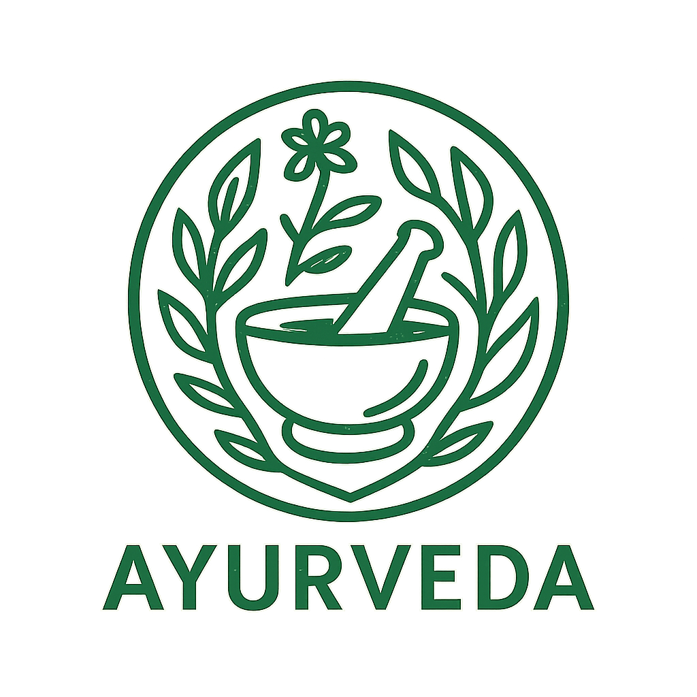

# Ayurveda Daily Update

 Welcome to **Ayurveda Daily Update**! 


This project delivers actionable Indian Ayurveda tips, tricks, and holistic guidance for modern daily living.  
Our goal is to help users integrate authentic Ayurveda practices—ranging from dietary suggestions and seasonal routines to daily wellness tips—seamlessly into their lifestyle.

---

## About This Repository

- **Purpose:**  
  Share trusted, practical Ayurveda advice for everyday wellness.

- **Content Includes:**  
  - Health tips rooted in Ayurveda
  - Simple home remedies
  - Dietary and seasonal recommendations
  - Mindfulness and lifestyle practices

- **Audience:**  
  Anyone interested in natural health, wellness, or Indian traditional medicine.

- **Technology:**  
  Built on Razor Pages and .NET Core for a fast, scalable, modern web experience.

---

## Features

- Daily Ayurveda tips and wellness updates
- Clean, mobile-friendly user interface
- Easy to add new tips and expand content
- Built using Microsoft technologies

---

## Getting Started

1. **Clone the repository:**
   ```bash
   git clone https://github.com/<your-username>/<repo-name>.git
   cd <repo-name>
   ```

2. **Build the project:**
   ```bash
   dotnet build
   ```

3. **Run the application:**
   ```bash
   dotnet run
   ```

4. **Browse to:**
   ```
   http://localhost:5000
   ```
   (Or your configured port)

---

## Project Structure

```
/AyurvedaDailyUpdate
│
├── Pages/           # Razor Pages (UI)
├── Models/          # Data models for Ayurveda tips
├── Services/        # Tip management and business logic
├── wwwroot/         # Static assets (CSS, JS, images)
├── appsettings.json # Configuration
└── Program.cs       # Application entry point
```

---

## Add-ons

- **Piranha CMS Integration:**  
  Easily manage and update Ayurvedic tips and content using Piranha CMS (MIT License).

- **Extensible Architecture:**  
  Add new modules or integrations (e.g., notification systems, user authentication, or additional CMS tools) as needed.

- **Mobile Responsive:**  
  Designed to work smoothly on mobile devices for wellness on-the-go.

---

## License

This project is licensed under the [MIT License](LICENSE).  
It also uses Piranha CMS and other tools under compatible open source licenses.

---

## Contribution

Contributions are welcome!  
- Fork the repository
- Create your feature branch (`feature/your-feature`)
- Submit a pull request

Feel free to suggest Ayurveda tips, report bugs, or improve features.

---

**Stay healthy, stay natural!**
